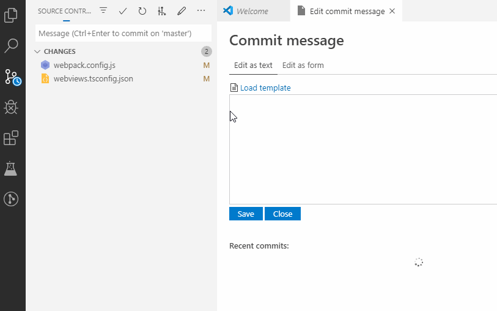
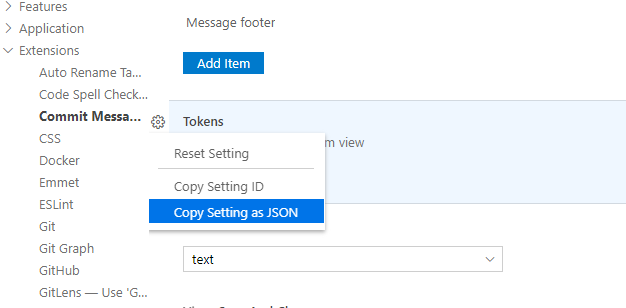

# Commit Message Editor

Edit commit messages in a convenient way.

## Features

- Pick an earlier commit message from recent commits
- Edit commit message in a form
- Customizable message template for conventional commits
- Customizable form fields
- Amend the last commit message
- Native look and feel (provided by [Vscode Webview Elements](https://github.com/bendera/vscode-webview-elements))

The factory settings follows the [Conventional Commits](https://www.conventionalcommits.org/) specification.

## Requirements

Built-in Git extension

## Extension Settings

This extension contributes the following settings:

- `commit-message-editor.confirmAmend`: Show confirm dialog before amend the commit message
- `commit-message-editor.staticTemplate`: Template for the text view
- `commit-message-editor.dynamicTemplate`: Template for the form view
- `commit-message-editor.tokens`: Editable inputs in the form view
- `commit-message-editor.view.defaultView`: Default view of the editor (textarea or form)
- `commit-message-editor.view.fullWidth`: The editor fills the whole available space
- `commit-message-editor.view.showRecentCommits`: Show recent commits in the main view
- `commit-message-editor.view.saveAndClose`: Close commit message editor tab after saving
- `commit-message-editor.view.visibleViews`: Which tab(s) should be visible: text, form or both

## Customizing the commit message form

The dynamic template contains template variables (tokens), which are between curly braces. Every token is displayed as a form widget in the form view. The easiest way to customizing tokens is to edit the default configuration. Find the tokens option under the Commit Message Editor settings and copy the setting to your user configuration.

### Available settings

| Name                       | Type    | Description                                                                                                                                                            | Valid for |
| -------------------------- | ------- | ---------------------------------------------------------------------------------------------------------------------------------------------------------------------- | --------- |
| label                      | string  | The label of the form item.                                                                                                                                            | all       |
| name                       | string  | The token name in the template.                                                                                                                                        | all       |
| type                       | enum    | The type of the token. Valid values are:  **text**: displayed as a text input **boolean**: displayed as a checkbox **enum**: displayed as a dropdown selector | all       |
| description                | string  | A longer text under the form item                                                                                                                                      | all       |
| prefix                     | string  | Text before the value. It will only be applied if the value is not empty                                                                                               | all       |
| suffix                     | string  | Text after the value. It will only be applied if the value is not empty                                                                                                | all       |
| multiline                  | boolean | Multiline text input                                                                                                                                                   | text      |
| lines                      | number  | Textarea initial height in lines                                                                                                                                       | text      |
| maxLines                   | number  | Textarea maximum height in lines                                                                                                                                       | text      |
| multiple                   | boolean | Multiple options                                                                                                                                                       | enum      |
| separator                  | string  | Separator character when multiple options were selected                                                                                                                | enum      |
| combobox                   | boolean | Is the selector filterable or not                                                                                                                                      | enum      |
| options                    | array   | Available options                                                                                                                                                      | enum      |
| options[_{n}_].label       | string  | The value of the option                                                                                                                                                | enum      |
| options[_{n}_].description | string  | A longer description for the option                                                                                                                                    | enum      |

### Sample configs

- [Default](https://github.com/bendera/vscode-commit-message-editor/blob/master/example-configs/default.json)
- [Gitmojis](https://github.com/bendera/vscode-commit-message-editor/blob/master/example-configs/gitmojis.json)

**Happy coding!**
