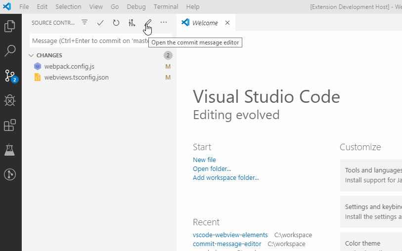

# Commit Message Editor

Edit commit messages in a convenient way.

## Features

* Pick an earlier commit message from recent commits
* Edit commit message in a form
* Customizable message template for conventional commits
* Customizable form fields
* Native look and feel (provided by [Vscode Webview Elements](https://github.com/bendera/vscode-webview-elements))

The factory settings use the [commit template](https://github.com/angular/angular/blob/master/CONTRIBUTING.md#-commit-message-guidelines) of Angular.

## Requirements

Built-in Git extension

## Extension Settings

This extension contributes the following settings:

* `commit-message-editor.staticTemplate`: Template for the text view
* `commit-message-editor.dynamicTemplate`: Template for the form view
* `commit-message-editor.tokens`: Editable inputs in the form view
* `commit-message-editor.view.defaultView`: Default view of the editor (textarea or form)
* `commit-message-editor.view.showRecentCommits`: Show recent commits in the main view

**Happy coding!**
